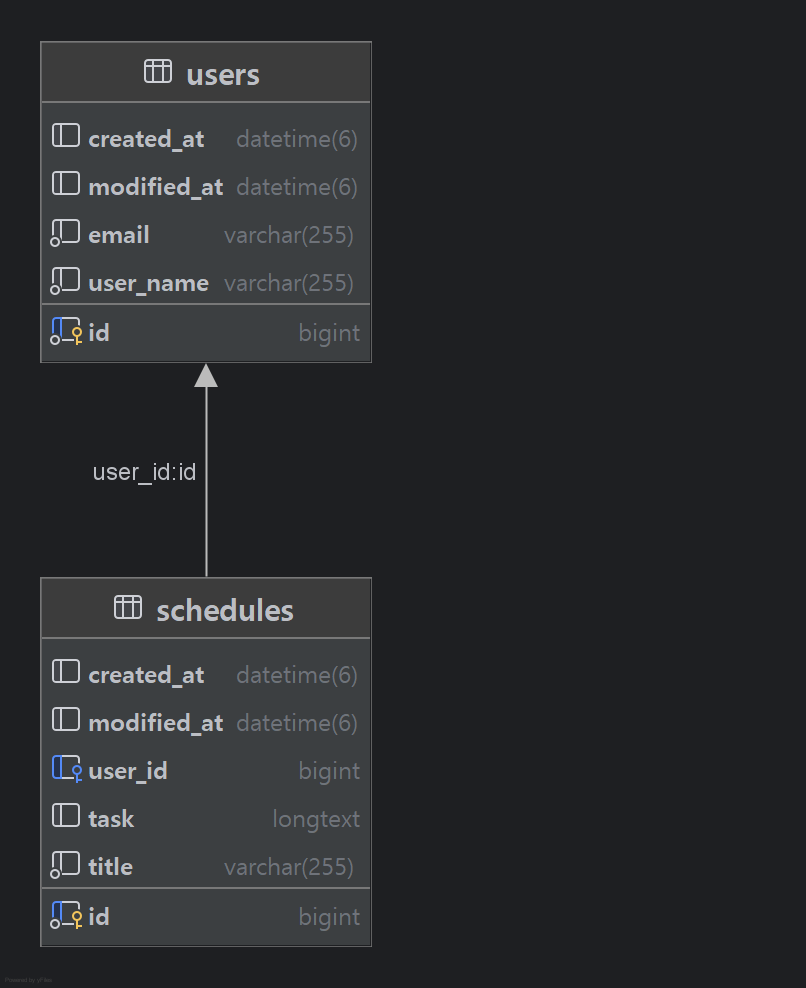

# Scheduler Web Application

## Schedule API Documents

## < 일정 생성 : Post >

일정을 생성하여 DB에 저장합니다.

### Request

#### 1. Request URL
localhost:8080/schedules

#### 2. RequestType : RequestBody

#### 3. Request Elements


| Parameter |  Type  | Required | Description |
|:---------:|:------:|:--------:|------------|
|   email   | String |    O     | 사용자 이메일    |
|   title   | String |    O     | 일정 제목      |
|   task    | String |    X     | 일정 내용      |

### Response

#### 1. Content-Type : jason

#### 2. Response Example
```xml
{
        "id": 1,
        "title": "test1",
        "task": "taskTest1",
        "createdAt": "2025-04-02T11:32:25.8605737",
        "modifiedAt": "2025-04-02T11:32:25.8605737"
        }
```
#### 3. Http Status Massage
|          Status           |   HttpStatus    |             Message             |  
|:-------------------------:|:---------------:|:-------------------------------:|
|           일정 등록           |   201 CREATED   |                X                |
|  email = null or 공백인 경우   | 400 BAD_REQUEST |      "email": "공백일 수 없습니다"      |
|    email 형식에 맞지 않은 경우     | 400 BAD_REQUEST | "email": "올바른 형식의 이메일 주소여야 합니다" |
|  일정 제목 = null or 공백인 경우   | 400 BAD_REQUEST |      "title": "공백일 수 없습니다"      |
| 각 Field와 다른 타입의 요청을 받을 경우 | 400 BAD_REQUEST |  "invalid request field value"  |

## < 전체 일정 조회 : Get >

전체 일정들을 조회 할 수 있습니다.

### Request

#### Request URL
localhost:8080/schedules

### Response

#### 1. Content-Type

jason

#### 2. Response Example
```xml
[
        {
        "id": 1,
        "title": "testTitle",
        "task": "testTask",
        "createdAt": "2025-04-01T17:29:10.378806",
        "modifiedAt": "2025-04-01T17:29:10.378806"
        },
        {
        "id": 2,
        "title": "testTitle1",
        "task": "testTask1",
        "createdAt": "2025-04-01T17:29:18.287987",
        "modifiedAt": "2025-04-01T17:29:18.287987"
        },
        {
        "id": 3,
        "title": "testTitle2",
        "task": "testTask2",
        "createdAt": "2025-04-01T17:29:23.452678",
        "modifiedAt": "2025-04-01T17:29:23.452678"
        }
        ]
```
#### 3. Http Status Massage
|           Status      |   HttpStatus    |         Massage         |  
|:---------------------:|:---------------:|:-----------------------:|
|             조회        |     200 OK      |            X            |
|     조회 결과가 존재하지 않을 경우 |  404 NOT_FOUND  |     "요청하신 일정을 찾을 수 없습니다."      |

## < 작성자 고유 식별 번호를 통한 조회 : Get >

작성자 고유 식별 번호로 개별 일정을 조회 할 수 있습니다.

### Request

#### 1. Request URL
localhost:8080/schedules/individual/{id}

#### 2. RequestType : PathVariable

#### 3. Request Elements

| PathVariable | Type | Required | Description  |
|:------------:|:----:|:--------:|--------------|
|   authorId   | Long |    O     | 작성자 고유 식별 번호 |


### Response

#### 1. Content-Type

jason

#### 2. Response Example
```xml
{
    "id": 1,
    "title": "test1",
    "task": "taskTest1",
    "createdAt": "2025-04-02T11:43:47.947639",
    "modifiedAt": "2025-04-02T11:43:47.947639"
}
```
#### 3. Http Status Massage
|           Status           |  HttpStatus   | Massage |  
|:--------------------------:|:-------------:|:-------:|
|             조회             |    200 OK     |    X    |
|     조회 결과가 존재하지 않을 경우      | 404 NOT_FOUND | "요청하신 일정을 찾을 수 없습니다."|
|  작성자 식별 번호 타입과 다른 요청의 경우   | 400 BAD_REQUEST |   "invalid request value"|
|      작성자 식별 번호 = null      | 400 BAD_REQUEST |   "@Validated failed"|

## < 작성자 고유 식별 번호를 통한 일정 수정 : Patch >

작성자 고유 식별 번호를 조건으로 작성자 명과 일정 제목, 일정 내용을 수정할 수 있습니다. 단, 일정 비밀번호가 일치하여야 합니다.

### Request

#### 1. Request URL
localhost:8080/schedules/individual/{id}

#### 2. RequestType : PathVariable, RequstBody

#### 3. Request Elements

|          | RequestType  |  Type  | Required | Description |
|:--------:|:--------:|:------:|:--------:|:-----------:|
| authorId | PathVariable |  Long  |    O     | 작성자 고유 식별 번호 |
|  title   | RequestBody  | String |    X     |    일정 제목    |
|   task   | RequestBody  | String |    X     |    일정 내용    |

### Response

#### 1. Content-Type

jason

#### 2. Response Example
```xml
[
{
//Old
    "id": 1,
    "title": "test1",
    "task": "taskTest1",
    "createdAt": "2025-04-02T11:43:47.947639",
    "modifiedAt": "2025-04-02T11:43:47.947639"
},

]
```
#### 3. Http Status Massage
|             Status             |   HttpStatus    | Massage |  
|:------------------------------:|:---------------:|:-------:|
|               수정               |     200 OK      |    X    |
|수정 요청 일정이 존재하지 않는 경우|  404 NOT_FOUND  |"요청하신 일정을 찾을 수 없습니다."|
|작성자 식별 번호 타입과 다른 요청의 경우   | 400 BAD_REQUEST |   "invalid request value"|
|      작성자 식별 번호 = null      | 400 BAD_REQUEST |   "@Validated failed" |
|각 Field와 다른 타입의 요청을 받을 경우 |400 BAD_REQUEST|"invalid request field value"|

## < 작성자 고유 식별 번호를 통한 일정 삭제 : Delete >

작성자 고유 식별 번호로 일정을 삭제 할 수 있습니다.

### Request

#### 1. Request URL
localhost:8080/schedules/individual/{id}

#### 2. RequestType : PathVariable

#### 3. Request Elements

|          | RequestType  |  Type  | Required | Description  |
|:--------:|:--------:|:------:|:--------:|:------------:|
| authorId | PathVariable |  Long  |    O     | 작성자 고유 식별 번호 |

### Response

#### Http Status Massage
|             Status             |  HttpStatus   |        Massage        |  
|:------------------------------:|:-------------:|:---------------------:|
|               삭제               |    200 OK     |           X           |
|      삭제 요청 일정이 존재하지 않는 경우      | 404 NOT_FOUND | "요청하신 일정을 찾을 수 없습니다." |
|    작성자 식별 번호 타입과 다른 요청의 경우     | 400 BAD_REQUEST |   "invalid request value"|
|        작성자 식별 번호 = null        | 400 BAD_REQUEST |   "@Validated failed"|

## User API Documents

## < 사용자 등록 : Post >

사용자 정보를 DB에 등록합니다.

### Request

#### 1. Request URL
localhost:8080/users

#### 2. RequestType : RequestBody

#### 3. Request Elements


| Parameter |  Type  | Required | Description |
|:---------:|:------:|:--------:|------------|
| userName  | String |    O     | 사용자 이름     |
|   email   | String |    O     | 사용자 email  |

### Response

#### 1. Content-Type : jason

#### 2. Response Example
```xml
{
        "id": 1,
        "userName": "박효성",
        "email": "qwer@asdf.com",
        "createdAt": "2025-04-02T11:43:42.1698882",
        "modifiedAt": "2025-04-02T11:43:42.1698882"
        }
```
#### 3. Http Status Massage
|          Status           |   HttpStatus    |             Message             |  
|:-------------------------:|:---------------:|:-------------------------------:|
|           일정 등록           |   201 CREATED   |                X                |
|  email = null or 공백인 경우   | 400 BAD_REQUEST |      "email": "공백일 수 없습니다"      |
|    email 형식에 맞지 않은 경우     | 400 BAD_REQUEST | "email": "올바른 형식의 이메일 주소여야 합니다" |
|  사용자 이름 = null or 공백인 경우  | 400 BAD_REQUEST |    "userName": "공백일 수 없습니다"     |
| 각 Field와 다른 타입의 요청을 받을 경우 | 400 BAD_REQUEST |  "invalid request field value"  |

## < 전체 사용자 조회 : Get >

모든 사용자 정보들을 조회 할 수 있습니다.

### Request

#### Request URL
localhost:8080/users

### Response

#### 1. Content-Type

jason

#### 2. Response Example
```xml
[
        {
        "id": 1,
        "userName": "박효성",
        "email": "qwer@asdf.com",
        "createdAt": "2025-04-02T11:43:42.169888",
        "modifiedAt": "2025-04-02T11:43:42.169888"
        },
        {
        "id": 2,
        "userName": "김두한",
        "email": "123@456.com",
        "createdAt": "2025-04-02T12:00:11.98394",
        "modifiedAt": "2025-04-02T12:00:11.98394"
        },
        {
        "id": 3,
        "userName": "오애순",
        "email": "zxc@uio.com",
        "createdAt": "2025-04-02T12:00:45.16158",
        "modifiedAt": "2025-04-02T12:00:45.16158"
        }
        ]
```
#### 3. Http Status Massage
|           Status      |   HttpStatus    |         Massage         |  
|:---------------------:|:---------------:|:-----------------------:|
|             조회        |     200 OK      |            X            |
|     조회 결과가 존재하지 않을 경우 |  404 NOT_FOUND  |     "요청하신 일정을 찾을 수 없습니다."      |

## < 사용자 고유 식별 번호를 통한 사용자 조회 : Get >

사용자 고유 식별 번호로 사용자 정보를 개별 조회 할 수 있습니다.

### Request

#### 1. Request URL
localhost:8080/users/individual/{id}

#### 2. RequestType : PathVariable

#### 3. Request Elements

| PathVariable | Type | Required | Description  |
|:------------:|:----:|:--------:|--------------|
|    userId    | Long |    O     | 사용자 고유 식별 번호 |


### Response

#### 1. Content-Type

jason

#### 2. Response Example
```xml
{
        "id": 3,
        "userName": "오애순",
        "email": "zxc@uio.com",
        "createdAt": "2025-04-02T12:00:45.16158",
        "modifiedAt": "2025-04-02T12:00:45.16158"
        }
```
#### 3. Http Status Massage
|         Status          |  HttpStatus   | Massage |  
|:-----------------------:|:-------------:|:-------:|
|           조회            |    200 OK     |    X    |
|    조회 결과가 존재하지 않을 경우    | 404 NOT_FOUND | "요청하신 일정을 찾을 수 없습니다."|
| 사용자 식별 번호 타입과 다른 요청의 경우 | 400 BAD_REQUEST |   "invalid request value"|
|    사용자 식별 번호 = null     | 400 BAD_REQUEST |   "@Validated failed"|

## < 사용자 고유 식별 번호를 통한 사용자 정보 수정 : Patch >

사용자 고유 식별 번호를 조건으로 사용자 이름과 email을 수정할 수 있습니다.

### Request

#### 1. Request URL
localhost:8080/users/individual/{id}

#### 2. RequestType : PathVariable, RequstBody

#### 3. Request Elements

|          | RequestType  |  Type  | Required | Description  |
|:--------:|:--------:|:------:|:--------:|:------------:|
|  userid  | PathVariable |  Long  |    O     | 사용자 고유 식별 번호 |
| userName | RequestBod   | String |    X     |    사용자 이름    |
|  email   | RequestBody  | String |    X     |  사용자 email   |

### Response

#### 1. Content-Type

jason

#### 2. Response Example
```xml
[
        { 
        //Old
        "id": 2,
        "userName": "김두한",
        "email": "123@456.com",
        "createdAt": "2025-04-02T12:00:11.98394",
        "modifiedAt": "2025-04-02T12:00:11.98394"
        },

]
```
#### 3. Http Status Massage
|          Status           |   HttpStatus    |             Massage             |  
|:-------------------------:|:---------------:|:-------------------------------:|
|            수정             |     200 OK      |                X                |
|   수정 요청 사용자가 존재하지 않는 경우   |  404 NOT_FOUND  |     "요청하신 사용자를 찾을 수 없습니다."      |
|  사용자 식별 번호 타입과 다른 요청의 경우  | 400 BAD_REQUEST |     "invalid request value"     |
|     사용자 식별 번호 = null      | 400 BAD_REQUEST |       "@Validated failed"       |
|    email 형식에 맞지 않은 경우     |            400 BAD_REQUEST     | "email": "올바른 형식의 이메일 주소여야 합니다" |
| 각 Field와 다른 타입의 요청을 받을 경우 |400 BAD_REQUEST|  "invalid request field value"  |

## < 사용자 고유 식별 번호를 통한 사용자 정보 삭제 : Delete >

사용자 고유 식별 번호로 사용자 정보를 삭제 할 수 있습니다.

### Request

#### 1. Request URL
localhost:8080/users/individual/{id}

#### 2. RequestType : PathVariable

#### 3. Request Elements

|        | RequestType  |  Type  | Required | Description  |
|:------:|:--------:|:------:|:--------:|:------------:|
| userId | PathVariable |  Long  |    O     | 사용자 고유 식별 번호 |

### Response

#### Http Status Massage
|         Status          |  HttpStatus   |            Massage            |  
|:-----------------------:|:-------------:|:-----------------------------:|
|           삭제            |    200 OK     |               X               |
|  삭제 요청 사용자가 존재하지 않는 경우  | 404 NOT_FOUND |    "요청하신 사용자를 찾을 수 없습니다."     |
| 작성자 식별 번호 타입과 다른 요청의 경우 | 400 BAD_REQUEST |    "invalid request value"    |
|    작성자 식별 번호 = null     | 400 BAD_REQUEST |      "@Validated failed"      |

## ERD
