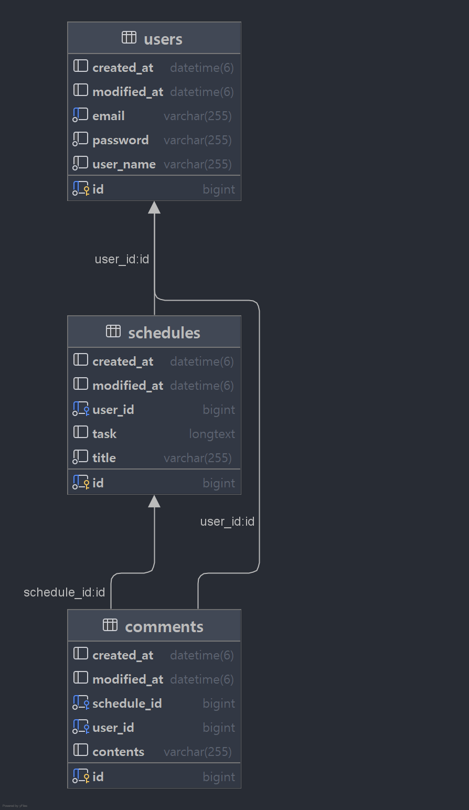

# Scheduler Web Application

## Schedule API Documents

## < 일정 생성 : Post >

일정을 생성하여 DB에 저장합니다.

### Request

#### 1. Request URL
localhost:8080/schedules

#### 2. RequestType : RequestBody

#### 3. Request Elements


| Parameter |  Type  | Required | Description |
|:---------:|:------:|:--------:|-------------|
|   name    | String |    O     | 작성자 명       |
|   title   | String |    O     | 일정 제목       |
|   task    | String |    X     | 일정 내용       |

### Response

#### 1. Content-Type : jason

#### 2. Response Example
```xml
{
    "id": 1,
    "authorName": "testName",
    "title": "testTitle",
    "task": "testTask",
    "createdAt": "2025-03-31T15:34:41.895599",
    "modifiedAt": "2025-03-31T15:34:41.895599"
}
```
#### 3. Http Status Massage
|          Status           |   HttpStatus |            Message            |  
|:-------------------------:|:-----:|:-----------------------------:|
|           일정 등록           |   201 CREATED |               X               |
|  작성자 명 = null or 공백인 경우   | 400 BAD_REQUEST |    "authorName": "공백일 수 없습니다"   |
|  일정 제목 = null or 공백인 경우   | 400 BAD_REQUEST |     "title": "공백일 수 없습니다"     |
| 각 Field와 다른 타입의 요청을 받을 경우 |400 BAD_REQUEST| "invalid request field value" |

## < 전체 일정 조회 : Get >

전체 일정들을 조회 할 수 있습니다.

### Request

#### Request URL
localhost:8080/schedules

### Response

#### 1. Content-Type

jason

#### 2. Response Example
```xml
[
        {
        "id": 1,
        "authorName": "testName",
        "title": "testTitle",
        "task": "testTask",
        "createdAt": "2025-04-01T17:29:10.378806",
        "modifiedAt": "2025-04-01T17:29:10.378806"
        },
        {
        "id": 2,
        "authorName": "testName1",
        "title": "testTitle1",
        "task": "testTask1",
        "createdAt": "2025-04-01T17:29:18.287987",
        "modifiedAt": "2025-04-01T17:29:18.287987"
        },
        {
        "id": 3,
        "authorName": "testName2",
        "title": "testTitle2",
        "task": "testTask2",
        "createdAt": "2025-04-01T17:29:23.452678",
        "modifiedAt": "2025-04-01T17:29:23.452678"
        }
        ]
```
#### 3. Http Status Massage
|           Status      |   HttpStatus    |         Massage         |  
|:---------------------:|:---------------:|:-----------------------:|
|             조회        |     200 OK      |            X            |
|     조회 결과가 존재하지 않을 경우 |  404 NOT_FOUND  |     "요청하신 일정을 찾을 수 없습니다."      |

## < 작성자 고유 식별 번호를 통한 조회 : Get >

작성자 고유 식별 번호로 개별 일정을 조회 할 수 있습니다.

### Request

#### 1. Request URL
localhost:8080/schedules/{authorId}

#### 2. RequestType : PathVariable

#### 3. Request Elements

| PathVariable | Type | Required | Description  |
|:------------:|:----:|:--------:|--------------|
|   authorId   | Long |    O     | 작성자 고유 식별 번호 |


### Response

#### 1. Content-Type

jason

#### 2. Response Example
```xml

```
#### 3. Http Status Massage
|           Status           |  HttpStatus   | Massage |  
|:--------------------------:|:-------------:|:-------:|
|             조회             |    200 OK     |    X    |
|     조회 결과가 존재하지 않을 경우      | 404 NOT_FOUND | "요청하신 일정을 찾을 수 없습니다."|
|  작성자 식별 번호 타입과 다른 요청의 경우   | 400 BAD_REQUEST |   "invalid request value"|
|      작성자 식별 번호 = null      | 400 BAD_REQUEST |   "@Validated failed"|

## < 작성자 고유 식별 번호를 통한 일정 수정 : Patch >

작성자 고유 식별 번호를 조건으로 작성자 명과 일정 제목, 일정 내용을 수정할 수 있습니다. 단, 일정 비밀번호가 일치하여야 합니다.

### Request

#### 1. Request URL
localhost:8080/schedules/{authorId}

#### 2. RequestType : PathVariable, RequstBody

#### 3. Request Elements

|          | RequestType  |  Type  | Required | Description |
|:--------:|:--------:|:------:|:--------:|:-----------:|
| authorId | PathVariable |  Long  |    O     | 작성자 고유 식별 번호 |
|   name   | RequestBod   | String |    X     |    작성자 명    |
|  title   | RequestBody  | String |    X     |    일정 제목    |
|   task   | RequestBody  | String |    X     |    일정 내용    |

### Response

#### 1. Content-Type

jason

#### 2. Response Example
```xml


```
#### 3. Http Status Massage
|             Status             |   HttpStatus    | Massage |  
|:------------------------------:|:---------------:|:-------:|
|               수정               |     200 OK      |    X    |
|수정 요청 일정이 존재하지 않는 경우|  404 NOT_FOUND  |"요청하신 일정을 찾을 수 없습니다."|
|작성자 식별 번호 타입과 다른 요청의 경우   | 400 BAD_REQUEST |   "invalid request value"|
|      작성자 식별 번호 = null      | 400 BAD_REQUEST |   "@Validated failed" |
|각 Field와 다른 타입의 요청을 받을 경우 |400 BAD_REQUEST|"invalid request field value"|

## < 작성자 고유 식별 번호를 통한 일정 삭제 : Delete >

작성자 고유 식별 번호로 일정을 삭제 할 수 있습니다.

### Request

#### 1. Request URL
localhost:8080/schedules/{authorId}

#### 2. RequestType : PathVariable

#### 3. Request Elements

|          | RequestType  |  Type  | Required | Description  |
|:--------:|:--------:|:------:|:--------:|:------------:|
| authorId | PathVariable |  Long  |    O     | 작성자 고유 식별 번호 |

### Response

#### Http Status Massage
|             Status             |  HttpStatus   |        Massage        |  
|:------------------------------:|:-------------:|:---------------------:|
|               삭제               |    200 OK     |           X           |
|      삭제 요청 일정이 존재하지 않는 경우      | 404 NOT_FOUND | "요청하신 일정을 찾을 수 없습니다." |
|    작성자 식별 번호 타입과 다른 요청의 경우     | 400 BAD_REQUEST |   "invalid request value"|
|        작성자 식별 번호 = null        | 400 BAD_REQUEST |   "@Validated failed"|
|    Field와 다른 타입의 요청을 받을 경우     |400 BAD_REQUEST|"invalid request field value"|

## ERD

